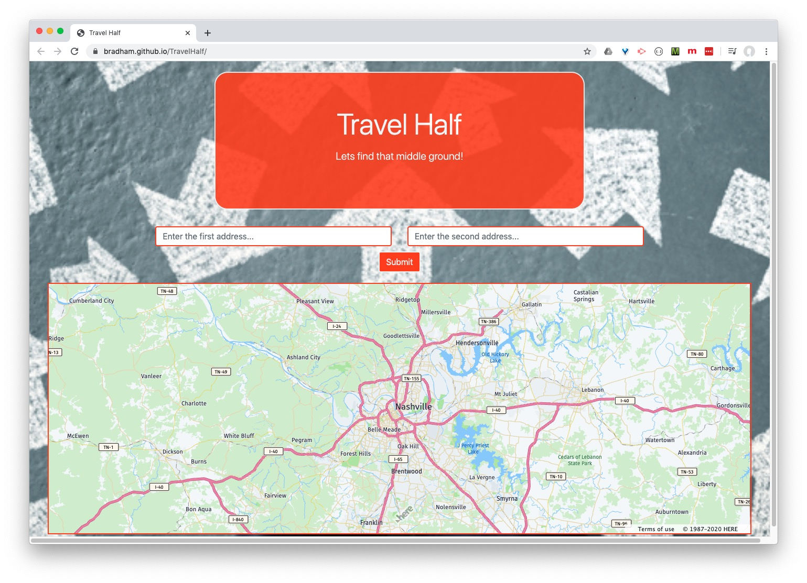

# TravelHalf
This is was the first project in the Vanderbilit Coding Bootcamp that I did with @SoInZane. This application called TravelHalf was built by Brad Ham and Cameron Wilson and utilizes the HERE API for map functionality and the Zomato API for restaurant information. TravelHalf is an app that helps people find the middle ground of two addresses or locations and then they have the option to also find restauraunts near that mid point. Users enter two addressess/locations and then submit the results. The onscreen map will then give them the mid point. They can then press a search restaurants button to give them a link to Zomato's website with restaurants that are near the mid point.

Are you ready to find that middle ground? TravelHalf is the answer! Check it out and see power of comprimise.

https://bradham.github.io/TravelHalf/

Original app:
https://soinzane.github.io/Compri-Meet/
